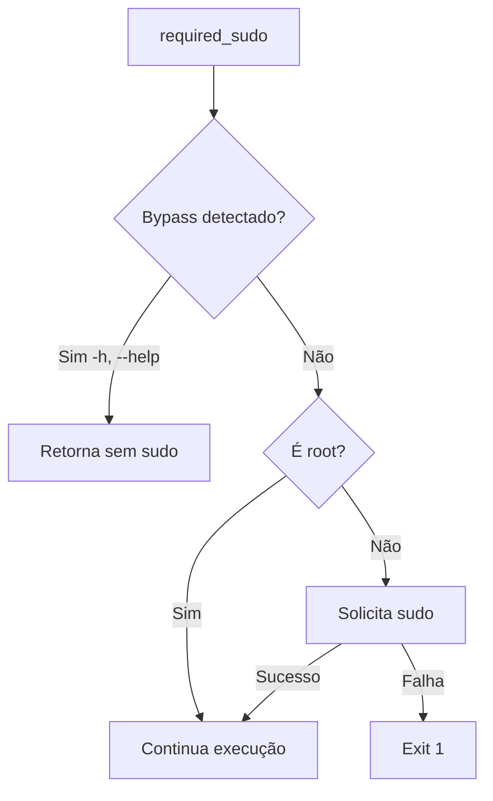

# sudo.sh

Funções para gerenciamento de privilégios de superusuário com bypass inteligente para operações somente leitura.

## Visão Geral

Este módulo fornece utilitários para gerenciar privilégios sudo de forma inteligente, incluindo:

- ✅ Verificação de privilégios root
- ✅ Solicitação de autenticação sudo quando necessário
- ✅ **Bypass automático** para comandos de ajuda e informação
- ✅ Lista centralizada de argumentos que não requerem sudo

## Funções

### `check_sudo()`

Verifica se o script está sendo executado como root.

**Retorno:**

- `0` - Executando como root
- `1` - Não está executando como root (imprime aviso)

**Uso:**

```bash
if check_sudo; then
    echo "Executando como root"
else
    echo "Sem privilégios de root"
fi
```

---

### `should_bypass_sudo()`

Verifica se algum argumento permite bypass da verificação de sudo. Útil para permitir que comandos de ajuda, versão e informações sejam executados sem sudo, mesmo quando o comando principal requer privilégios elevados.

**Argumentos de Bypass (Built-in):**

- `-h`, `--help`, `help` - Comandos de ajuda
- `-v`, `--version`, `version` - Informações de versão
- `--info` - Informações do software

**Parâmetros:**

- `$@` - Todos os argumentos do comando

**Retorno:**

- `0` - Bypass permitido (operação somente leitura detectada)
- `1` - Sudo deve ser requerido (nenhum argumento de bypass encontrado)

**Uso:**

```bash
if should_bypass_sudo "$@"; then
    echo "Operação somente leitura, sudo não necessário"
else
    echo "Operação requer sudo"
fi
```

**Adicionando Novos Argumentos de Bypass:**

Para adicionar novos argumentos que não requerem sudo, edite o array `bypass_args` na função:

```bash
local bypass_args=(
    "-h"
    "--help"
    # ... outros argumentos
    "--meu-novo-argumento"  # Adicione aqui
)
```

---

### `required_sudo()`

Garante privilégios sudo ou sai com erro. **Agora com bypass automático** para operações somente leitura.

**Comportamento:**

1. Verifica se algum argumento permite bypass (`should_bypass_sudo`)
2. Se bypass detectado: retorna sem solicitar sudo
3. Se já é root: não faz nada
4. Se não é root: pede senha sudo
5. Se falhar: sai com exit 1

**Parâmetros:**

- `$@` - Argumentos do comando (verificados para bypass)

**Uso Básico:**

```bash
#!/usr/bin/env zsh
set -euo pipefail
IFS=$'\n\t'

source "$LIB_DIR/sudo.sh"

# Garante que temos sudo (mas permite --help sem sudo)
required_sudo "$@"

# Aqui já temos sudo garantido (exceto em modo help)
apt-get update
```

**Exemplo com Bypass:**

```bash
# Este comando NÃO pedirá sudo (--help está na lista de bypass)
susa setup docker --help

# Este comando PEDIRÁ sudo (operação de instalação)
susa setup docker
```

## Exemplos Práticos

### Exemplo 1: Comando com Sudo e Bypass

```bash
#!/usr/bin/env zsh
set -euo pipefail
IFS=$'\n\t'

source "$LIB_DIR/sudo.sh"
source "$LIB_DIR/logger.sh"

show_help() {
    echo "Uso: comando [opções]"
    echo "  -h, --help    Mostra ajuda"
}

# Passa argumentos para verificação de bypass
required_sudo "$@"

# Se chegou aqui e não é help, temos sudo
log_info "Instalando pacotes..."
apt-get install package
```

### Exemplo 2: Verificação Condicional

```bash
#!/usr/bin/env zsh
set -euo pipefail
IFS=$'\n\t'

source "$LIB_DIR/sudo.sh"

# Verifica manualmente se precisa de sudo
if ! should_bypass_sudo "$@"; then
    if ! check_sudo; then
        log_warning "Este comando requer sudo"
        required_sudo "$@"
    fi
fi

# Continua com a execução...
```

### Exemplo 3: Script Completo de Instalação

```bash
#!/usr/bin/env zsh
set -euo pipefail
IFS=$'\n\t'

source "$LIB_DIR/sudo.sh"
source "$LIB_DIR/logger.sh"

show_help() {
    log_output "Ajuda do comando..."
    exit 0
}

main() {
    # Parse argumentos
    while [[ $# -gt 0 ]]; do
        case "$1" in
            -h|--help)
                show_help
                ;;
            *)
                shift
                ;;
        esac
    done

    # Garante sudo (mas help já foi tratado acima)
    required_sudo "$@"

    log_info "Instalando software..."
    apt-get install software
}

main "$@"
```

## Integração com command.json

Quando um comando tem `"sudo": true` no `command.json`, o CLI automaticamente chama `required_sudo "$@"` antes de executar o script, mas permite bypass para argumentos de ajuda.

```json
{
  "name": "docker",
  "description": "Instala Docker",
  "sudo": true,
  "entrypoint": "main.sh"
}
```

## Boas Práticas

1. ✅ **Sempre passe `"$@"`** para `required_sudo` para habilitar bypass
2. ✅ Use no início de comandos que modificam o sistema
3. ✅ Combine com campo `sudo: true` no command.json
4. ✅ Informe o usuário antes de pedir sudo (já feito automaticamente)
5. ✅ Permita comandos de ajuda sem sudo (automático via bypass)
6. ✅ Adicione argumentos customizados de bypass quando necessário

## Argumentos de Bypass Padrão

A lista completa de argumentos que não requerem sudo:

| Argumento | Descrição |
|-----------|-----------|
| `-h`, `--help`, `help` | Exibe ajuda do comando |
| `-v`, `--version`, `version` | Mostra versão |
| `--info` | Informações do software |

## Fluxo de Execução


